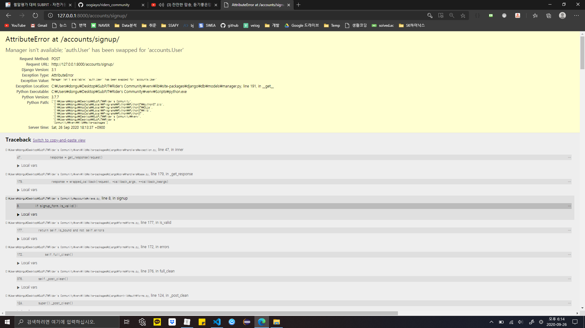

# README.md





왜 에러뜨지ㅣㅣㅣㅣㅣ

```
위의 오류는 UserCreationForm은 auth.User에서 사용하는 폼이며, 저는 User모델을 커스텀해서 사용했기 때문에,
from .models import User
class SignupForm(UserCreationForm):
   class Meta(UserCreationForm.Meta):
       model = User
       fields = ['username', 'email', 'first_name', 'last_name']
커스텀한 models.py의 User 모델을 직접 가지고와서 Meta 클래스안에 model로 지정해주셔야 합니다~~

```

```
This is a common problem with changing the User mid-way through a project. Common recommendation is to always create a custom User at the beginning of every project, even if it's the same as AbstractUser. That way if you ever need to add/modify the User in the future you don't run into this.
```

